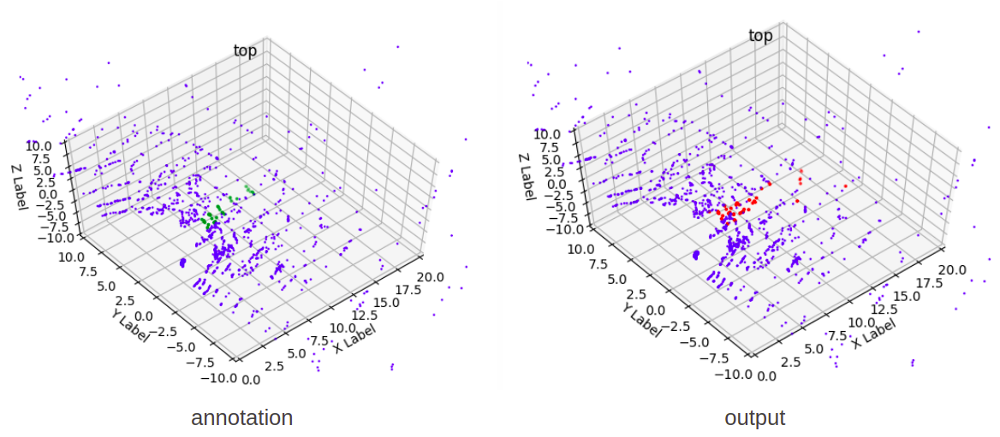

## Pointcloud-based Row Detection for Agriculture Robot
This repo contains python codes that detects traversible row for agriculture robots  
using [ShellNet](https://arxiv.org/pdf/1908.06295.pdf). The model in this repo is a naive pytorch adoption of [the authors'   
tensorflow release](https://github.com/hkust-vgd/shellnet). Note that the very same pipeline could be used for generic  
object detection, and semantic segmentation, while this work only concerns about  
detecting a single row without row switching.

The purpose of this work is to enable autonomous, LIDAR-based in-row navigation for  
agriculture robots. Specifcially, to address the occassions where GPS are not reliable  
 or not accurate enough. The training data were collected from a vineyard field using  
Velodyne's VLP-16, which was mounted on a mobile agriculture robot.  

## ShellNet
Proposed in 2019, ShellNet was designed to process pointcloud data directly. The  
authors introduced a new method called shell convolution. Essentially, it obtains  
sorted k nearest neighbor, divides them into D cells, selects the maximum feature  
from each cell, and finally combines the features from each cell with a traditio-  
nal 1D convolution. The network is then constructed with multi-layers of shellconv  
layers, using an encoder-decoder architecture like UNet.

## Run with Visualization
download data using link in ./data/README.md and put them under /data

         cd evaluation && python3 evaluate.py --model ../weight/shellnet01/91.pth

## Run using Ros
change subsriber channel as needed  

         cd ros && python2.7 row_decection 
    
## Input and Target
The model was trained with 150 sets of pointcloud data. The model takes as input  
an downsampled pointcloud tensor (1024 x 3), and a label tensor (1024,) with each  
 element represents one of the N class in [0, N) 

## Success Example

## Limitations
The network was mostly trained on data facing forward, with vehicle standing in the center.  
The behavior when the vehicle has different orientation is poorer. It could make more  
sense to detect vineyard instead of rows.  

Also, the KNN implementation of the model is naive, which could be optimized. In addition,  
the sampling method in this work is uniform sampling, but some more advanced sampling in  
the [author's work](https://github.com/hkust-vgd/shellnet) could also be implemented.

## License
MIT License
